## Installation de Windows Server 2022 avec TightVNC et une connexion SSH

### Étape 1 : Préparation

1. [Télécharger l'ISO de Windows Server 2022](https://www.microsoft.com/en-us/evalcenter/evaluate-windows-server-2022) : Allez sur le site officiel de Microsoft pour télécharger l'ISO de Windows Server 2022.
2. Ouvrir Proxmox
3. Ayez un compte utilisateur avec les droits nécessaires pour créer des VM sur Proxmox

### Étapes 2 : Création de la VM Windows Server 2022

### Étapes

#### 1. Télécharger l'ISO sur Proxmox

- Connectez-vous à l'interface web de Proxmox.
- Accédez à `Datacenter` > `pve` (votre nœud Proxmox) > `Disques locaux` (par exemple, `local` ou `local-lvm`).
- Cliquez sur l'onglet `Content` puis sur `Upload`.
- Sélectionnez l'image ISO de Windows Server 2022 et téléchargez-la.

#### 2. Créer une nouvelle VM

- Dans l'interface web de Proxmox, cliquez sur le nœud où vous voulez créer la VM.
- Cliquez sur `Create VM` dans le coin supérieur droit.
- **General** :
  - Donnez un nom à votre VM.
- **OS** :
  - Sélectionnez le stockage où se trouve votre ISO et choisissez l'ISO de Windows Server 2022.
  - Choisissez `Microsoft Windows` comme type d'OS.
- **System** :
  - Gardez les paramètres par défaut ou ajustez selon vos besoins.
- **Hard Disk** :
  - Sélectionnez le stockage et configurez la taille du disque virtuel (par exemple, 60GB ou plus selon vos besoins).
- **CPU** :
  - Définissez le nombre de sockets et de cœurs selon les ressources disponibles.
- **Memory** :
  - Allouez la mémoire (par exemple, 4096 MB pour 4GB de RAM).
- **Network** :
  - Configurez l'interface réseau (généralement, le mode par défaut `virtio` fonctionne bien).

#### 3. Démarrer la VM et installer Windows Server 2022

- Sélectionnez la VM nouvellement créée dans le volet de gauche.
- Cliquez sur `Start` pour démarrer la VM.
- Cliquez sur `Console` pour accéder à la console de la VM.
- Suivez les étapes de l'assistant d'installation de Windows Server 2022.
  - Choisissez la langue, le format de l'heure, et la méthode de clavier.
  - Cliquez sur `Install Now`.
  - Entrez la clé de produit si nécessaire.
  - Sélectionnez la version de Windows Server 2022 à installer.
  - Acceptez les termes de licence.
  - Choisissez `Custom: Install Windows only (advanced)`.
  - Sélectionnez le disque et cliquez sur `Next` pour installer Windows Server 2022.

#### 4. Finaliser l'installation de Windows Server 2022

- Complétez l'installation de Windows Server en suivant les instructions à l'écran.
- Configurez les paramètres initiaux, tels que le mot de passe administrateur.

## Étape 3: Configuration et Installation de TightVNC

1. [Télécharger TightVNC](https://www.tightvnc.com/download.php) : Téléchargez la dernière version de TightVNC pour Windows 
   
   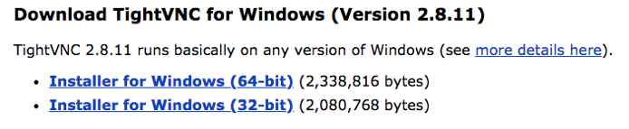

2. Cliquez sur `Next`.

  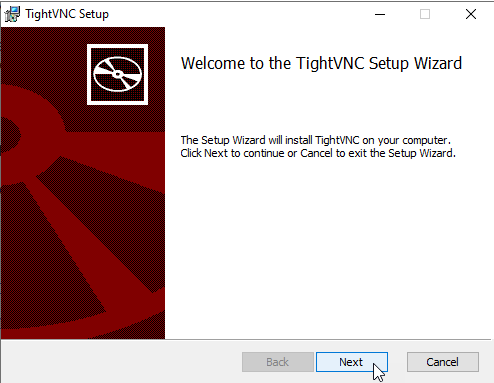

3. Acceptez les règles et cliquez sur `Next`.

  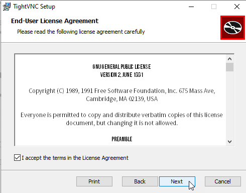

4. Cliquez sur `Custom`.

  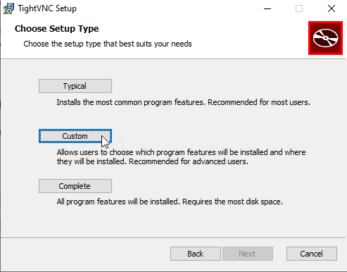

5. Cliquez sur `TightVNC server`* et selectionner `Entire feature will be unavailable`.

   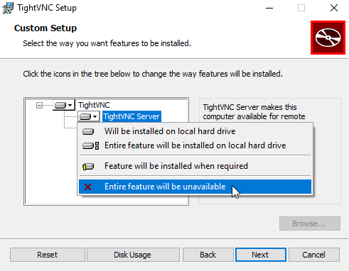

6. Cliquez sur `Next`.

   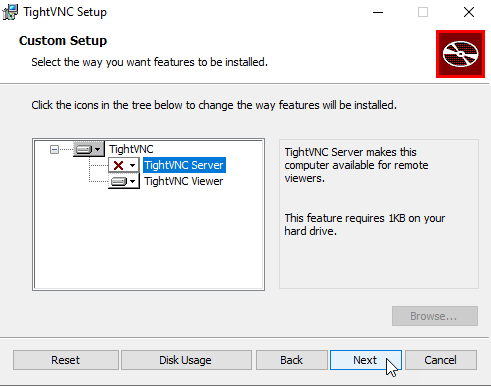

7. Cliquez sur `Next`.

   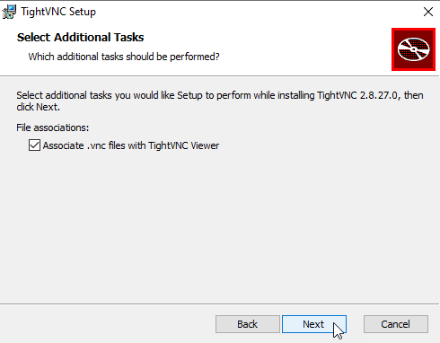

8. Cliquez sur `Install`.

   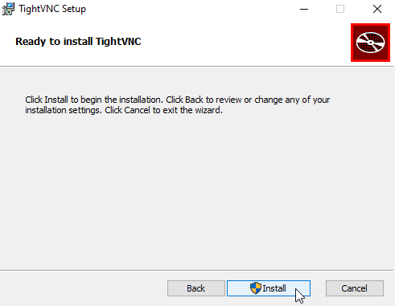

9. Cliquez sur `Finish`.

   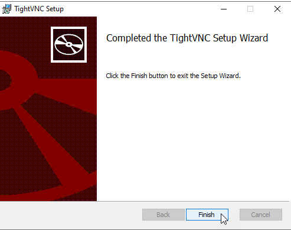

10. Le panneau suivant joue un rôle crucial pour assurer la sécurité de l'installation de TightVNC sur cet ordinateur. Il est nécessaire de définir deux mots de passe distincts :

- **Le premier mot de passe** garantit la sécurité de l'accès à distance à cet ordinateur. Tout client VNC désirant se connecter devra connaître ce mot de passe.

- **Le second mot de passe protège** la configuration et le fonctionnement de TightVNC sur cet ordinateur. Toute modification de la configuration ou toute opération sur le serveur TightVNC devra être validée avec ce mot de passe.

   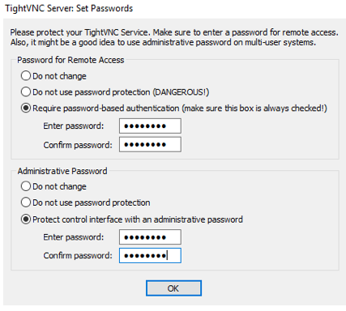

## Étape 5: Ouvrir les ports VNC (5800 et 5900) dans Windows Defender

  #### 1. Ouvrir le Pare-feu Windows Defender avec sécurité avancée

  - Appuyez sur les touches `Windows + R` pour ouvrir la boîte de dialogue "Exécuter".
  - Tapez `wf.msc` et appuyez sur `Entrée`.
  
     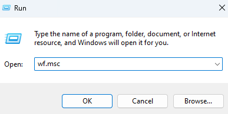
 
  #### 2. Ajouter une nouvelle règle pour le port 5800

  - Dans le volet de gauche, cliquez sur `Règles de trafic entrant`.

  - Dans le volet de droite, cliquez sur `Nouvelle règle...`.

     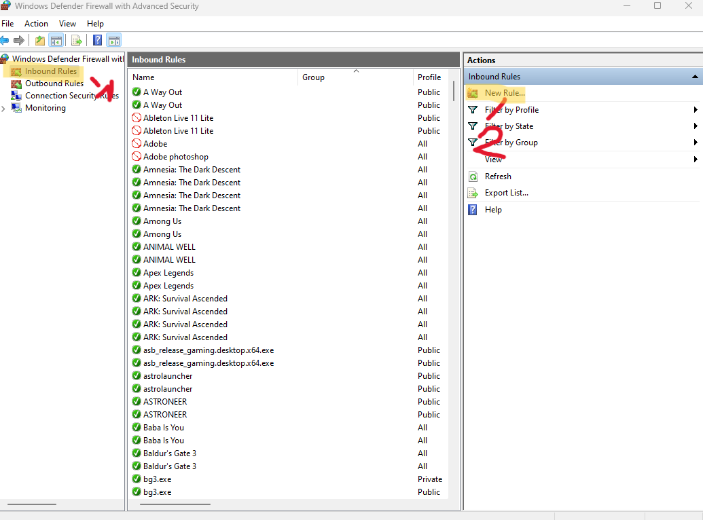
 
  - Sélectionnez `Port` et cliquez sur `Suivant`.

      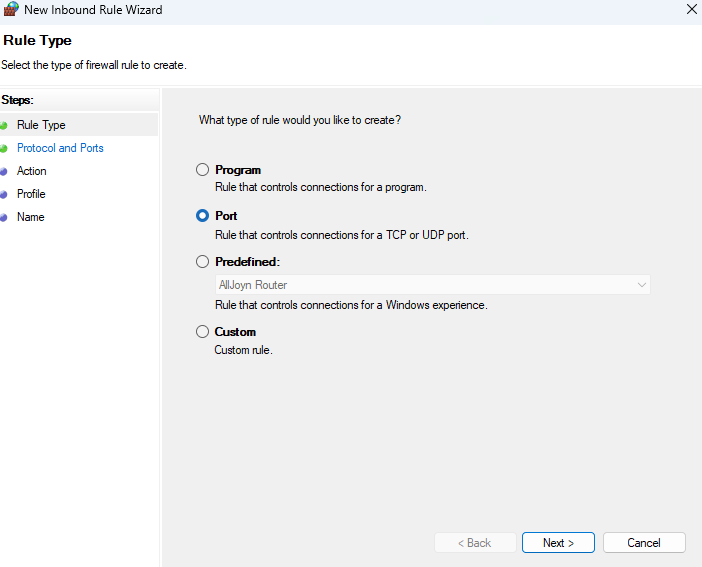

  - Choisissez `TCP` et sélectionnez `Ports locaux spécifiques`. Entrez `5800` dans le champ et cliquez sur `Suivant`.

      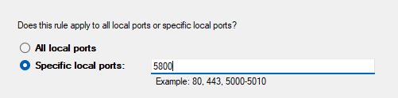
    
  - Sélectionnez `Autoriser la connexion` et cliquez sur `Suivant`.

      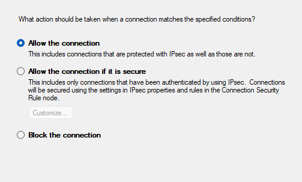
    
  - Cochez les cases selon votre profil de réseau (`Domaine`, `Privé`, `Public`) et cliquez sur `Suivant`.

     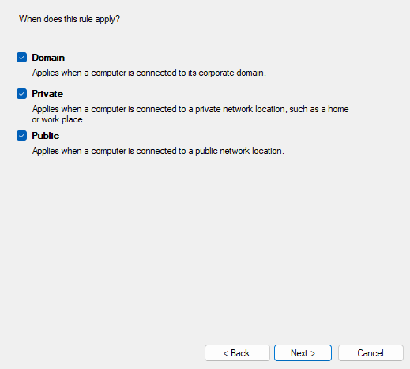
 
  - Donnez un nom à la règle, par exemple `Ouvrir Port 5800`, et cliquez sur `Terminer`.
    
     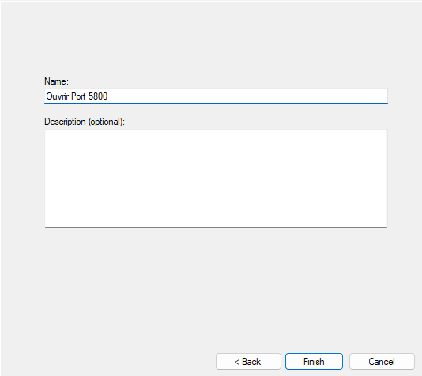

  #### 3. Répéter pour le port 5900

  - Répétez les mêmes étapes que pour le port 5800, mais entrez `5900` à la place de `5800`.
  - Nommez la règle `Ouvrir Port 5900`.

   
## Étape 6: Configuration de TightVNC 

1. **Configurer TightVNC pour démarrer automatiquement :** Une fois l'installation terminée, assurez-vous que TightVNC est configuré pour démarrer automatiquement avec le système. Vous pouvez généralement trouver cette option dans les paramètres de démarrage ou de services de Windows.

2. **Tester la connexion VNC :** Avant de passer à la prochaine étape, assurez-vous de tester la connexion TightVNC en utilisant le client VNC depuis une machine distante. Assurez-vous que vous pouvez vous connecter au serveur Windows Server 2022 à l'aide du nom d'utilisateur et du mot de passe que vous avez configurés.

## Étape 7: Configuration de la connexion SSH

1. **Vérifier la disponibilité de SSH :** Assurez-vous que le service SSH est en cours d'exécution sur votre serveur Windows Server 2022. Vous pouvez le vérifier en recherchant le service "OpenSSH SSH Server" dans la liste des services Windows.

2. **Configurer les autorisations SSH :** Si nécessaire, configurez les autorisations SSH pour permettre la connexion à distance en utilisant des clés SSH ou des identifiants de connexion.

3. **Testez la connexion SSH :** Utilisez un client SSH tel que PuTTY ou OpenSSH pour vous connecter à votre serveur Windows Server 2022. Assurez-vous que la connexion fonctionne correctement en vous connectant avec les identifiants appropriés.

  

